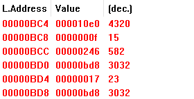
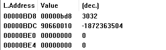
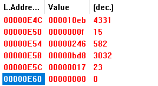

### 实验一报告

#### 1. 简述head.s的工作原理

boot.s首先将head.s的代码加载到0x00处，随后跳转到0x00开始执行head.s。

我们首先需要初始化各寄存器的值，接着设置IDT表GDT表，初始化时会先将IDT的中断门均填成默认的处理过程的描述符。然后设置系统定时芯片，每十毫秒向中断控制器发送一个中断请求。接着将IDT表的第8（0x08）项设置为定时中断门描述符，将第128（0x80）项设置为系统调用陷阱门描述符。最后切换到任务0执行，其后任务1任务0交替切换执行（表现为不断交替打印A和打印B）。

任务0和任务1每隔十毫秒便切换一次（0x08时钟中断），切换时查看current（当前任务编号）变量中的值，如果为0则利用任务1的TSS选择符选择跳转位置，从而切换到任务1中。否则反之。每个任务执行过程中，会将一个字符的ASCII码存入寄存器AL中，接着调用0x80中断
，将该字符输出到屏幕上。在输出后，任务代码会延迟一段时间然后再开始循环，直到运行十毫秒，发生任务切换。任务0打印A，任务1打印B，故我们在屏幕上能够看到不断循环打印的连续A和连续B，若是偶然出现了字符C，那说明我们的系统偶然调用了一个非时钟中断和系统调用中断的中断（由于我们将其他中断处理均设置为默认处理方法ignore_int，默认处理方法为打印C）

#### 2. 记录head.s的内存分布状态

| 代码段名称 |  起始地址 |  终止地址  |
|:----------:|:-------------:|:-------:|
| startup_32 |  0x0000 | 0x00ac |
| setup_gdt |  0x00ad|0x00b4|
| setup_idt | 0x00b5 |0x00e4|
| write_char | 0x00e5 | 0x0113 |
| ignore_int | 0x0114 | 0x0129 |
| timer_interrupt | 0x012a | 0x0165 |
| system_interrupt | 0x0166 | 0x017c |
| task0 | 0x10e0 | 0x10f3 |
| task1 | 0x10f4 | 0x1106 |

| 数据段名称 |  起始地址 |  终止地址  |
|:--------:|:-----------:|:-------:|
| current | 0x017d | 0x0180 |
| scr_loc | 0x0181 | 0x0184|
| lidt_opcode | 0x0186 | 0x018b |
| lgdt_opcode | 0x018c | 0x0191 |
| idt | 0x0198 | 0x0997 |
| gdt | 0x0998 | 0x09d7 |
| ldt0 | 0x0be0 | 0x0bf7 |
| ldt1 | 0x0e60 | 0x0e77 |
| tss0 | 0x0bf8 | 0x0c5f |
| tss1 | 0x0e78 | 0x0edf |

|堆栈段名称|起始地址|终止地址|
|:--:|:--:|:--:|
| Init_stack | 0x09d8 | 0x0bd8 |
| Krn_stk0 | 0x0c60 | 0x0e60 |
| Krn_stk1 | 0x0e00 | 0x10e0|
| User_stk1 | 0x1108 | 0x1308 |

#### 3. 简述head.s 57-62行进行的操作

在初始堆栈中人工设置返回环境，从内核态返回到用户态

- 57：将任务0当前的数据段选择符入栈
- 58：将堆栈指针入栈
- 59：将标志寄存器值入栈
- 60：将当前局部空间代码段选择符入栈
- 61：将代码指针入栈
- 62：执行中断返回指令，切换到特权级3的任务0中

#### 4. 简述iret执行后，pc如何找到下一条指令

执行iret后，将推入堆栈的段地址和偏移地址弹出，使程序返回到原来发生中断的地方。PC会根据弹出的cs寄存器里的值（查LDT）得到段基址，然后加上eip的值得到下一条指令的地址。（若是内核态返回用户态则还会弹出EFLAGS寄存器的值和堆栈指针，并将其保存在SS和ESP寄存器中，切换回原来的堆栈）

#### 5. 记录iret执行前后，栈的变化

执行前：栈顶元素即为57-61行压入的内容，esp=0x0bc4

执行后：将上述压入的元素全部弹出，esp变为0x0bd8，此时esp指向栈底，实际上栈为空

#### 6. 当任务进行系统调用时，即 int 0x80 时，记录栈的变化情况

执行0x80系统调用中断前，栈为task0或task1的用户栈，内容如下，栈为空：

执行中断后，堆栈变为此任务的系统栈：

可以发现我们先压入了原先的堆栈段寄存器SS（0x17）的值，接着压入了原先的ESP值（0x0bd8），接着压入了EFLAGS，CS，EIP寄存器的值。