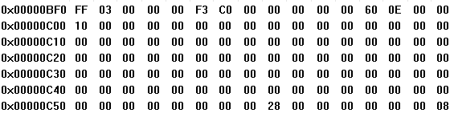
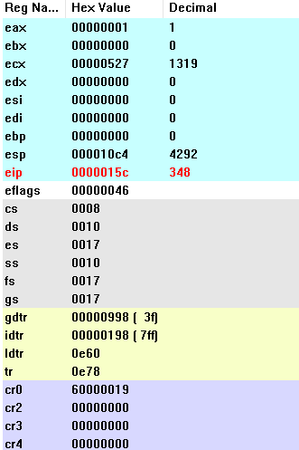

### 实验二报告

#### 1. 当执行完 system_interrupt 函数，执行 153 行 iret 时，记录栈的变化情况

执行153行iret命令前，栈为task0的内核栈：

执行153行iret命令后，系统栈弹出CS，EIP寄存器的值，得到下一条指令的位置，接着弹出EFLAGS寄存器的值，最后弹出寄存器ESP，SS寄存器的值，切换回task0的用户栈（也就是Init_stack）:

#### 2. 当进入和退出 system_interrupt 时，都发生了模式切换，请总结模式切换时，特权级是如何改变的？栈切换吗？如何进行切换的？

- 特权级切换：
    - 由task进入系统中断前，cs值为0x0f（后四位1111，后两位11，对应特权级3，用户态），说明此时程序运行在用户态，随后执行int 0x80指令，查找IDT表第0x80项并将表项的段选择子加载到cs寄存器中，查表发现段选择子为0x08，对应二进制后四位为1000，后两位00代表切换到内核态执行，前两位10代表查找gdt表第一个段描述符得到基地址。即将0x08载入cs后，后续任务在内核态执行。
    - 从系统中断中退出时亦然，将会从栈中弹出下一条指令的地址即cs值和eip值，cs值变回0x0f，即返回了用户态。
- 栈切换：
    - 在进入系统中断前，查看当前TSS表的ss0字段和esp0字段得到在特权级0下的堆栈指针，随后压入需要保存的寄存器值，包括当前的堆栈指针（ss，esp），EFLAGS寄存器值，cs，eip寄存器值。
    - 退出系统中断时，从栈中弹出先前压入的栈指针（ss，esp）即可切换回原先的堆栈（用户栈）。

#### 3. 当时钟中断发生，进入到 timer_interrupt 程序，请详细记录从任务 0 切换到任务 1 的过程。

进入timer_interrupt，首先压入一些寄存器的值将其保存下来（只修改了ds和eax的值），接着让ds指向内核数据段，然后向8259A发送EOI命令。接着判断当前任务是否为1，若不是则将eax（eax=1）的值赋给current字段用于表示当前进行的任务编号，随后利用jmp命令跳转到任务1。（jmp指令后跟段选择子0x30，查gdt表得到tss1，即任务1的tss段）

任务0切换到任务1前切换前任务0的TSS字段：

任务0切换到任务1前切换前任务1的TSS字段：

任务0切换到任务1前切换前各寄存器值：

切换后，任务0的TSS0字段变为：

切换后，各寄存器的值变为：

- 可以发现，我们将切换任务前的各寄存器值均按顺序存放在了tss0的各个字段中，同时观察GDT表项，可以发现tss0描述符的busy位被置0，tss1描述符的busy位被置成了1
- 观察切换后寄存器的值和切换前任务1的tss1字段，可以发现寄存器将任务1tss字段中的对应值加载进了当前寄存器中，同时可以发现ir的值自动进行了更新，从开始指向tss0的起始地址0x0bf8变为了tss1的起始地址0x0e78。

#### 4. 又过了 10ms，从任务1切换回到任务 0，整个流程是怎样的？ TSS 是如何变化的？各个寄存器的值是如何变化的？

会先进入timer_interrupt，在timer_interrupt中判断当前任务是否为1（当前任务的编号存于current字段中），若是则将current设置为0然后利用jmp命令跳转到任务0。跳转指令后接0x20段选择子，查gdt表得到任务0的tss段。

任务1切换回任务0，当前任务1的tss段为：

任务1切换回任务0，当前任务0的tss段：

任务1切换回任务0之前各寄存器的值为：

切换后，任务1的tss段变为：

切换后，当前寄存器的值变为：

- 还是同任务0切换任务1的过程，我们会在任务切换时，修改任务1的tss段，将各寄存器的值保存在tss1的固定位置，这样当切换回任务时方便复原现场。
- 同任务0切换成任务1的过程，根据jmp后的段选择子（0x20）得到tss0，将tss0中存储的各寄存器的值加载进cpu当前的寄存器中，完成现场恢复。
- tss0的段描述符busy位置1，tss1的段描述符b=0。

#### 5. 请详细总结任务切换的过程。

- 从作为JMP或CALL指令的操作数中，或者从任务门中，或者从当前TSS的back link字段中取得新任务的TSS段选择子。
- 检查当前任务是否允许切换到新任务，主要是比对当前任务的CPL，新任务段选择子的RPL和TSS段描述符的DPL。往往要求CPL和RPL值必须小于等于DPL才允许跳转。同时，无论目标任务门，TSS段描述符段的DPL为何值，异常，中断和iret都允许执行任务切换。（INT指令需要检查特权级）
- 检查新任务的TSS描述符的P位（present = 1），并且检查TSS段的长度是否有效（大于0x67）。如果试图执行可能会产生错误的命令，将会恢复对处理器的修改。
- 如果任务切换产生自JMP或IRET指令，处理器会将旧任务的TSS段B（busy）位复位，如果是CALL指令或异常或中断，则不修改B位。
- 如果任务切换由IRET产生，处理器会将临时保存的EFLAGS映像中的NT标志复位；其余情况则不改动NT标志。
- 把当前任务的状态保存到当前任务的TSS中。从TR寄存器中取得当前任务的TSS基地址，随后将通用寄存器值，段寄存器的段选择符，标志寄存器EFLAGS以及指令指针EIP值存入TSS中。
- 如果任务切换是由CALL指令或异常或中断产生，则处理器会从新任务中加载的EFLAGS中的NT标志置位，否则不修改EFLAGS的标志。
- 如果任务是由CALL，中断，异常产生，则处理器会设置新TSS描述符中的B标志，如果是由IRET指令产生，则不修改B。
- 将新任务TSS状态加载进处理器。包括LDTR寄存器，CR3寄存器，EFLAGS寄存器，EIP寄存器，通用寄存器，段选择符等。
- 开始执行新任务。