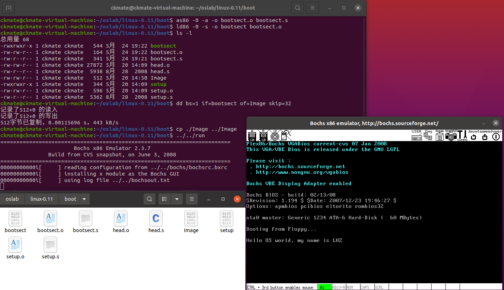
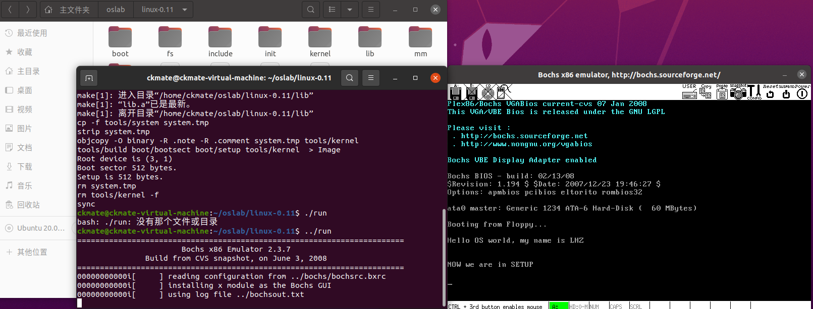
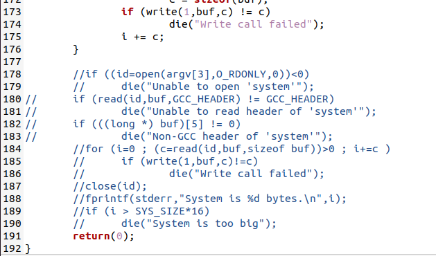
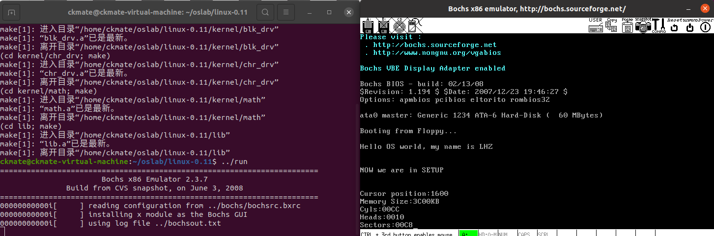
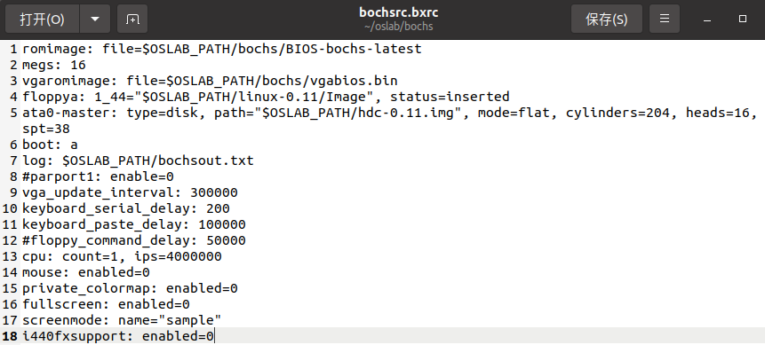

## Lab03

### 1. 有时，继承传统意味着别手蹩脚。 x86 计算机为了向下兼容，导致启动过程比较复杂。 请找出 x86 计算机启动过程中，被硬件强制，软件必须遵守的两个“多此一举”的步骤（多找几个也无妨），说说它们为什么多此一举，并设计更简洁的替代方案。

- 在x86计算机的启动过程中，为了保持兼容，会首先将引导扇区读入 0x7c00 处（将之前较多的连续内存留给操作系统），然后跳到 0x7c00 开始执行，接着，为了方便后面程序的加载与运行，引导程序又会将自己移动到靠后的位置。这样先移动是多此一举的。
- 解决方案：在保证可靠性的前提下尽量扩大实地址模式下BIOS可访问的内存的范围，如引导扇区加载到0x90000等内存高地址处而不是0x7c00。
- 在BIOS初始化的时候，会在内存的初始位置放置1kb的中断向量表，来方便BIOS中断使用。 如果在主模块中需要使用一些由BIOS中断得到的硬件参数的情况下，就不能在主模块的加载开始过程中直接覆盖掉这1kb的中断向量表而让主模块直接从内存的初始位置加载（从内存的初始位置加载的话以后代码中的地址就是实际的地址，能极大的方便操作）。为了解决这个问题，在linux 0.11 中，会将system先加载到不与中断向量表冲突的地方，然后再将主模块移动到内存的初始位置，再将这个中断向量表覆盖掉。
- 解决方案：1kb的中断向量表不放在内存的初始位置，而是放到其他实模式下能够寻址的其他地方。 这样操作系统的system模块就会直接加载到内存的初始位置。

### 2. bootsect.s的屏幕输出

输出"Hello OS world, my name is LHZ"



实现步骤如下：

#### 2.1 关键代码

```x86asm
_start:
! 功能号ah置0x03，bh置0，int 0x10读取光标位置并返回给寄存器
    mov ah,#0x03
    xor bh,bh
    int 0x10
    mov cx,#36
! 36是字符串的长度，字符串“Hello OS world, my name is LHZ”长度为30
! 但我们还要加上三个换行和回车，所以字符串长度为 30+2*3=36
    mov bx,#0x0007
! es:bp 是字符串的地址，我们需要处理es和bp的数值
    mov bp,#msg1
    mov ax,#0x07c0
    mov es,ax
! 功能号ah=13，al=01(目标字符串仅仅包含字符，属性在BL中包含，光标停在字符串结尾处)
! 合起来ax=0x1301
! int 0x10显示字符串
    mov ax,#0x1301
    int 0x10

! 要设置一个无限循环卡住在这
inf_loop:
    jmp inf_loop
```

接着修改字符串信息即msg1

```x86asm
msg1:
    .byte   13,10 ! 换行+回车
    .ascii  "Hello OS world, my name is LHZ"
    .byte   13,10,13,10

! 设置引导扇区标记 0xAA55
! boot_flag 必须在最后两个字节
.org 510
boot_flag:
    .word   0xAA55
```

#### 编译链接bootsect.s并运行

执行命令：

```
as86 -0 -a -o bootsect.o bootsect.s
ld86 -0 -s -o bootsect bootsect.o
```

发现bootsect文件大小为544字节>512字节，原因是 ld86 产生的是 Minix 可执行文件格式，这样的可执行文件除了文本段、数据段等部分以外，还包括一个 Minix 可执行文件头部，它的结构如下：

```c
struct exec {
    unsigned char a_magic[2];  //执行文件魔数
    unsigned char a_flags;
    unsigned char a_cpu;       //CPU标识号
    unsigned char a_hdrlen;    //头部长度，32字节或48字节
    unsigned char a_unused;
    unsigned short a_version;
    long a_text; long a_data; long a_bss; //代码段长度、数据段长度、堆长度
    long a_entry;    //执行入口地址
    long a_total;    //分配的内存总量
    long a_syms;     //符号表大小
};
```

去掉这个头部（6\*1 + 2 + 4\*6 = 32字节）就可以放入引导扇区了

```
dd bs=1 if=bootsect of=Image skip=32
```

将文件拷贝到linux-0.11下，命名为Image，接着在oslab目录下./run即可得到最开始展示的结果

### 3. setup.s的屏幕输出

bootsect.s正确载入setup.s，并输出"Now we are in SETUP"



#### 关键代码

setup.s跟之前bootsect.s中的代码差不多，将输出字符串换成"Now we are in SETUP"

```x86asm
    mov ah,#0x03
    xor bh,bh
    int 0x10
! 字符串长度为25 = 19 + 6
    mov cx,#25
    mov bx,#0x0007
    mov bp,#msg2
    mov ax,cs
! 直接用cs更新es的值
    mov es,ax
    mov ax,#0x1301
    int 0x10

msg2:
    .byte 13,10
    .ascii "NOW we are in SETUP"
    .byte 13,10,13,10
.org 510
boot_flag:
    .word 0xAA55
```

接着编写bootsect.s中载入setup.s的关键代码

```x86asm
load_setup:
    mov    dx,#0x0000               !设置驱动器和磁头(drive 0, head 0): 软盘0磁头
    mov    cx,#0x0002               !设置扇区号和磁道(sector 2, track 0):0磁头、0磁道、2扇区
    mov    bx,#0x0200               !设置读入的内存地址：BOOTSEG+address = 512，偏移512字节
    mov    ax,#0x0200+SETUPLEN      !设置读入的扇区个数(service 2, nr of sectors)，
                                    !SETUPLEN是读入的扇区个数，Linux 0.11设置的是4，
                                    !我们不需要那么多，我们设置为2
    int    0x13                     !应用0x13号BIOS中断读入2个setup.s扇区
    jnc    ok_load_setup            !读入成功，跳转到ok_load_setup: ok - continue
    mov    dx,#0x0000               !软驱、软盘有问题才会执行到这里。我们的镜像文件比它们可靠多了
    mov    ax,#0x0000               !否则复位软驱 reset the diskette
    int    0x13
    jmp    load_setup               !重新循环，再次尝试读取
ok_load_setup:
    jmpi    0,SETUPSEG              !接下来要干什么？当然是跳到setup执行。
```

接下来如果直接编译链接：

```
make BootImage
```

会出现错误，这是因为我们的系统只需要bootsect.s和setup.s而build.c并没有考虑这种情况

#### 修改build.c

修改工作主要集中在 build.c 的尾部，argv[3] = None，将需要用到argv[3]（即system）的部分注释掉即可。id是system文件的文件描述符，buf则为暂存system内容的数组，i计算system大小，将这些全部注释掉即可。



重新make，接着run即可。

### 4. setup.s获取硬件信息



#### 硬件信息获取

用 ah=0x03 调用 0x10 中断可以读出光标的位置，用 ah=0x88 调用 0x15 中断可以读出内存的大小，int 0x41（4*0x41 = 0x0000:0104）的中断向量位置存放的并不是中断程序的地址，而是存放的是磁盘参数表的偏移地址和段地址。

将首地址的偏移地址赋值给si寄存器，将首地址的段地址赋值给ds寄存器：

```x86asm
lds    si,[4*0x41]
```

总体关键代码如下:
```x86asm
mov    ax,#INITSEG
mov    ds,ax        !设置ds=0x9000
mov    ah,#0x03     !读入光标位置
xor    bh,bh
int    0x10         !返回：dh = 行号；dl = 列号
mov    [0],dx       !将光标位置写入0x90000.

!读入内存大小位置
mov    ah,#0x88
int    0x15         !返回：ax = 从0x100000(1M)处开始的扩展内存大小(KB)
mov    [2],ax       !写入0x90002处

!从0x41处拷贝16个字节（磁盘参数表）
mov    ax,#0x0000
mov    ds,ax
lds    si,[4*0x41] !si寄存器得到偏移地址，ds得到段地址
mov    ax,#INITSEG
mov    es,ax
mov    di,#0x0004  !复制地址从0x90004开始
mov    cx,#0x10
rep                !重复16次
movsb              !按字节传送，si->di
```

#### 参数以十六进制方式显示

显示时只需将原二进制数每 4 位划成一组，按组求对应的 ASCII 码送显示器即可。ASCII 码与十六进制数字的对应关系为：0x30 ～ 0x39 对应数字 0 ～ 9，0x41 ～ 0x46 对应数字 a ～ f。从数字 9 到 a，其 ASCII 码间隔了 7。为使一个十六进制数能按高位到低位依次显示，实际编程中，需对 bx 中的数每次循环左移一组（4 位二进制），然后屏蔽掉当前高 12 位，对当前余下的 4 位（即 1 位十六进制数）求其 ASCII 码，要判断它是 0 ～ 9 还是 a ～ f，是前者则加 0x30 得对应的 ASCII 码，后者则要加 0x37 才行，最后送显示器输出。以上步骤重复 4 次，就可以完成 bx 中数以 4 位十六进制的形式显示出来。
```x86asm
print_hex:
    mov    cx,#4         ! 4个十六进制数字
    mov    dx,(bp)       ! 将(bp)所指的值放入dx中，如果bp是指向栈顶的话
print_digit:
    rol    dx,#4         ! 循环以使低4比特用上 !! 取dx的高4比特移到低4比特处。
    mov    ax,#0xe0f     ! ah = 请求的功能值，al = 半字节(4个比特)掩码。
    and    al,dl         ! 取dl的低4比特值。
    add    al,#0x30      ! 给al数字加上十六进制0x30
    cmp    al,#0x3a
    jl     outp          ! 是一个不大于十的数字
    add    al,#0x07      ! 是a～f，要多加7
outp:
    int    0x10
    loop   print_digit
    ret
```

#### 与bochsrc对照

这些都和上面打出的参数吻合，表示此次实验是成功的。

