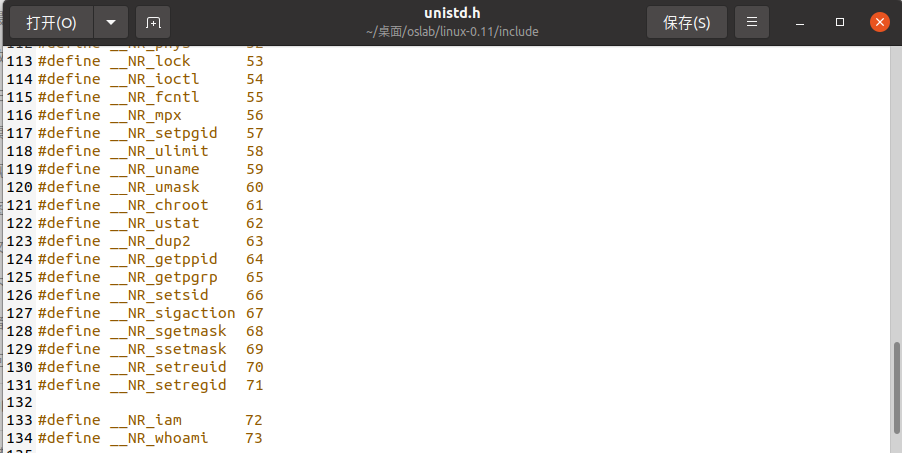
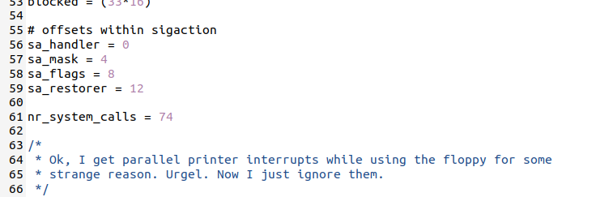
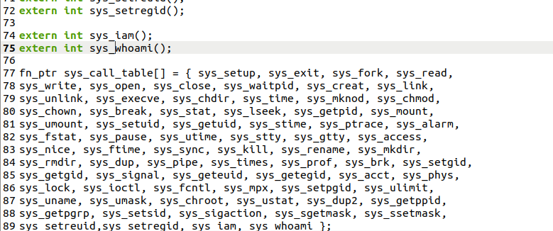
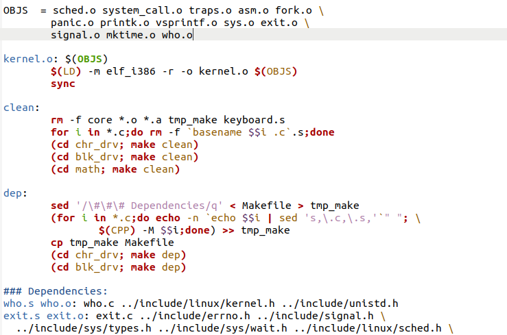
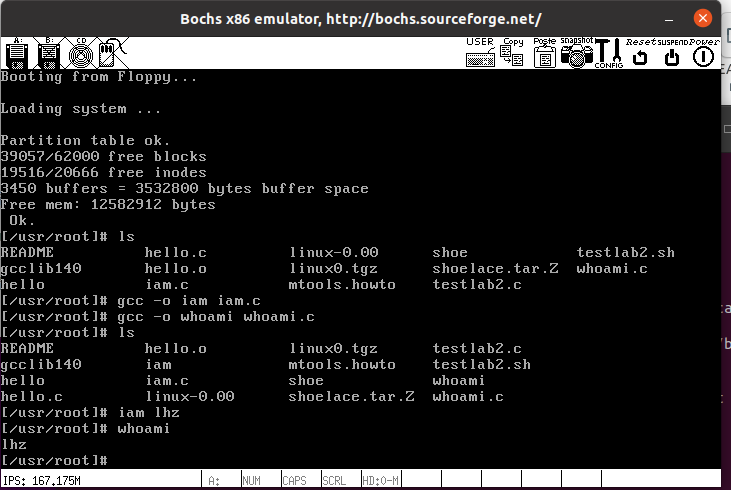
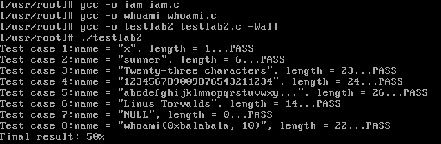
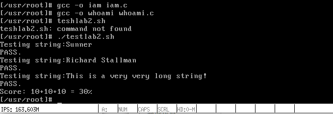

## Lab 04

### 1. 问题

#### 1.1 从 Linux 0.11 现在的机制看，它的系统调用最多能传递几个参数？

- 观察linux-0.11/include/unistd.h代码，发现_syscall宏展开的系统调用最多3个参数（_syscall3(type, name, atype, a, btype, b, ctype, c)），使用ebx，ecx，edx三个寄存器传递参数。

#### 1.2 你能想出办法来扩大这个限制吗？

- 增加用于传参的寄存器数量
- 利用堆栈传递参数
- 寄存器循环传值
- 将需要传递的多个参数保存在有特定结构的区间中，并将该用户态地址空间的这个区间的首地址作为一个参数传递给系统调用。最后通过寄存器间接寻址方式便可以访问所有参数。

#### 1.3 用文字简要描述向 Linux 0.11 添加一个系统调用 foo() 的步骤。

- 首先要在unistd.h中定义宏__NR_foo，并修改system_call.s中的nr_system_calls值，使其+1
- 然后为foo系统调用名（extern type sys_foo()），并在系统调用表中按顺序（NR）添加sys_foo函数
- 在foo.c中添加供用户调用的函数：type sys_foo()
- 修改kernel中的makefile文件，将foo.c与内核其他文件编译链接在一起
- 用户调用时用_syscallN宏展开系统调用，提供用户态的系统调用接口（参数数目确定具体宏N=1,2,3）

### 2. 实验过程

按照实验指导书一步步完成

#### 2.1 添加iam和whoami系统调用

找到./linux-0.11/include/unistd.h，在最后两行加上两个函数的__NR_iam和__NR_whoami的宏定义，数值往后递增即可：分别定义为72和73。



同时还要去修改调用函数总数：72->74（./linux-0.11/kernel/system_call.s）



为新增的系统调用添加系统调用名并维护系统调用表，./linux-0.11/include/linux/sys.h



注意新增的调用函数在sys_call_table数组的位置要跟之前定义的宏定义值对应，因为在int 0x80后初始化时会设置一个门调用system_call函数，而system_call函数中调用了：

```x86asm
call sys_call_table(,%eax,4)
```

eax中存的是系统调用号，即在unistd.h中定义的NR值，这句代码可以写成这样：

```x86asm
call sys_call_table + 4 * %eax   # 其中eax中放的是系统调用号，即__NR_xxxxxx
```

#### 2.2 sys_iam和sys_whoami函数的实现

内核中的调用设置都已经完成，现在只需要在内核中实现函数sys_iam和sys_whoami，仿照其他系统调用对应的sys_xxxx函数，照着格式进行编写：

```c
#include <string.h>
#include <errno.h>
#include <asm/segment.h>

char msg[24];

int sys_iam(const char * name)
{
    char tep[26];
    int i = 0;
    for(; i < 26; i++)
    {
        tep[i] = get_fs_byte(name + i);  //从用户输入得到字符
        if(tep[i] == '\0')  break;       //字符串结束
    }

    if (i > 23) return -(EINVAL);        //长度超过23

    strcpy(msg, tep);
    return i;
}

int sys_whoami(char * name, unsigned int size)
{
    int len = 0;
    for (;msg[len] != '\0'; len++);
    
    if (len > size)                     //size 小于需要的空间
    {
        return -(EINVAL);          
    }
    
    int i = 0;
    for(i = 0; i < size; i++)
    {
        put_fs_byte(msg[i], name+i);
        if(msg[i] == '\0') break;
    }
    return i;
}
```

#### 2.3 修改makefile

修改kernel/Makefile，将who.c编译并与其他代码链接在一起



#### 2.4 测试程序的编写

```c
/* iam.c */
#define __LIBRARY__
#include <unistd.h> 
#include <errno.h>
#include <asm/segment.h> 
#include <linux/kernel.h>
_syscall1(int, iam, const char*, name);
   
int main(int argc, char *argv[])
{
    /*调用系统调用iam()*/
    iam(argv[1]);           // argv[1]即为第一个参数，即用户输入的字符串
    return 0;
}

```

```c
/* whoami.c */
#define __LIBRARY__
#include <unistd.h> 
#include <errno.h>
#include <asm/segment.h> 
#include <linux/kernel.h>
#include <stdio.h>
   
_syscall2(int, whoami,char *,name,unsigned int,size);
   
int main(int argc, char *argv[])
{
    char username[64] = {0};
    /*调用系统调用whoami()*/
    whoami(username, 24);
    printf("%s\n", username);
    return 0;
}
```

将其cp到hdc/usr/root下（顺便将testlab2.c和testlab2.sh移进去），测试：



#### 2.5 testlab2测试


