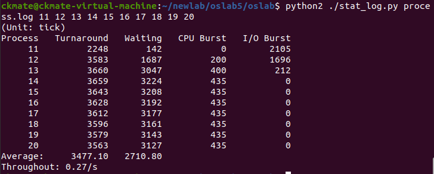

## Lab 05

### 1. 问题

#### 1.1 单进程编程和多进程编程最大的区别是什么？

- 单进程编程仅一个进程顺序执行，多进程编程可以通过并发控制，在多个进程间切换执行，可以充分利用多核CPU的性能。
- 对于程序设计者来说，单进程编程较于多进程编程要更简单，但是CPU利用率更低，而多进程编程是同步执行的，需要复杂且灵活的调度算法，但能够充分利用CPU资源，其情况要复杂得多。在设计多进程编程时，要考虑资源的分配，时间片的分配等达到系统调度的平衡。

#### 1.2-1 你是如何修改时间片的？

在include/linux/sched.h中修改#define INIT_TASK宏定义中的priority数值，初值为15：

```c
#define INIT_TASK\
/* state etc */ { 0,15,15
...
```

#### 1.2-2 仅针对样本程序建立的进程，在修改时间片前后， log 文件的统计结果（不包括Graphic）都是什么样？

设置时间片大小为1：


设置时间片大小为5：


设置时间片大小为10：


设置时间片大小为15：


设置时间片大小为20：


设置时间片大小为50：


设置时间片大小为100：


#### 1.2-3 结合你的修改分析一下为什么会这样变化，或者为什么没变化？
可以发现随着时间片的变大，平均等待时间和平均周转时间不断变长，这是由于时间片过大，CPU在每个进程上耗费的时间过多，CPU效率变低，吞吐率也变低。但同时若时间片过小，CPU将频繁切换进程，切换进程的代价高昂，频繁切换进程也会导致进程平均等待时间和平均周转时间变长。

故时间片设置不应过大也不应过小。

### 2. 实验过程

#### 2.1 编写样本程序（process.c）

用fork建立若干同时运行的子程序，用wait让父进程等待子进程结束再退出：

```c
void cpuio_bound(int last, int cpu_time, int io_time);

int main(int argc, char * argv[]){
	pid_t n_proc[10]; /*10个子进程 PID*/
	int i;
	for(i = 0; i < 10; i++){
		n_proc[i] = fork();     //fork创建子进程
		if(n_proc[i] == 0){
			cpuio_bound(20, 2 * i, 20 - 2 * i); //每个子进程都占用20
			return 0;   //结束子进程
		}
		/*fork 失败*/
		else if(n_proc[i] < 0){
			printf("Failed to fork child process %d!\n", i + 1);
			return -1;
		}
	}
	/*父进程打印所有子进程PID*/
	for(i = 0; i < 10; i++)
		printf("Child PID: %d\n", n_proc[i]);
	/*并等待所有子进程完成*/
	wait(&i);
	return 0;
}

void cpuio_bound(int last, int cpu_time, int io_time){
	struct tms start_time, current_time;
	clock_t utime, stime;
	int sleep_time;

	while(last > 0){
		/* CPU Burst */
		times(&start_time);   //记录进程开始时间（时钟数）
		do{
			times(&current_time);   //记录当前时间（时钟数）
			utime = current_time.tms_utime - start_time.tms_utime;
			stime = current_time.tms_stime - start_time.tms_stime;
		}while(((utime + stime) / HZ)  < cpu_time);     //时钟数 * (1/hz) = t
		last -= cpu_time;
		if(last <= 0)
			break;
		/* IO Burst */
		/* 用sleep(1)模拟1秒钟的I/O操作 */
		sleep_time = 0;
		while (sleep_time < io_time){
			sleep(1);
			sleep_time++;
		}
		last -= sleep_time;
	}
}
```

#### 2.2 打开log文件

修改init/main.c函数，使其尽早打开process.log文件

```c
/*in function main*/ 
    /*main中打开process.log文件*/
    setup((void *) &drive_info);    //加载文件系统
    (void) open("/dev/tty0",O_RDWR,0); //打开/dev/tty0，建立文件描述符0和/dev/tty0的关联
    (void) dup(0);  //打开/dev/tty0，建立文件描述符0和/dev/tty0的关联
    (void) dup(0);  //让文件描述符2也和/dev/tty0关联
    (void) open("/var/process.log",O_CREAT|O_TRUNC|O_WRONLY,0666);
    /*open dup返回的一定是未使用的最小的描述符数值 参见《UNIX环境高级编程》(第三版) P51*/
    /*添加结束*/
```

#### 2.3 写log文件

在printk.c文件中增加fprintk函数：

```c
#include <linux/sched.h>
#include <sys/stat.h>

static char logbuf[1024];
int fprintk(int fd, const char *fmt, ...)
{
    va_list args;
    int count;
    struct file * file;
    struct m_inode * inode;

    va_start(args, fmt);
    count=vsprintf(logbuf, fmt, args);
    va_end(args);

    if (fd < 3)    /* 如果输出到stdout或stderr，直接调用sys_write即可 */
    {
        __asm__("push %%fs\n\t"
            "push %%ds\n\t"
            "pop %%fs\n\t"
            "pushl %0\n\t"
            "pushl $logbuf\n\t" /* 注意对于Windows环境来说，是_logbuf,下同 */
            "pushl %1\n\t"
            "call sys_write\n\t" /* 注意对于Windows环境来说，是_sys_write,下同 */
            "addl $8,%%esp\n\t"
            "popl %0\n\t"
            "pop %%fs"
            ::"r" (count),"r" (fd):"ax","cx","dx");
    }
    else    /* 假定>=3的描述符都与文件关联。事实上，还存在很多其它情况，这里并没有考虑。*/
    {
        // if (!(file=task[0]->filp[fd]))    /* 从进程0的文件描述符表中得到文件句柄 */
        //    return 0;
        
        // 修改为如下：
        // task[1]->filp is not ready or f_inode->i_dev is not ready
        if (!(file=task[1]->filp[fd]) || !task[1]->filp[fd]->f_inode->i_dev) {   /* 从进程1的文件描述符表中得到文件句柄 */
            return 0;
        }
        inode=file->f_inode;

        __asm__("push %%fs\n\t"
            "push %%ds\n\t"
            "pop %%fs\n\t"
            "pushl %0\n\t"
            "pushl $logbuf\n\t"
            "pushl %1\n\t"
            "pushl %2\n\t"
            "call file_write\n\t"
            "addl $12,%%esp\n\t"
            "popl %0\n\t"
            "pop %%fs"
            ::"r" (count),"r" (file),"r" (inode):"ax","cx","dx");
    }
    return count;
}
```

#### 2.4 寻找状态切换点

##### 记录一个进程生命期的开始

修改fork.c文件，输出两种状态，分别是“N（新建）”和“J（就绪）”

```c
/* in function copy_process */
    p->start_time = jiffies; 
    //新建进程，（N）
    fprintk(3,"%d\tN\t%d\n",p->pid,jiffies);
    //...
    /* 设置进程状态为就绪。所有就绪进程的状态都是TASK_RUNNING(0），被全局变量 current 指向的是正在运行的进程。*/
    p->state = TASK_RUNNING;    
    //进程就绪，（J）
    fprintk(3,"%d\tJ\t%d\n",p->pid,jiffies);
```

##### 记录进入睡眠态的时间

修改sched.c文件，其中进程的就绪与运行间的状态转移是通过 schedule()（它亦是调度算法所在）完成的；进程的运行到睡眠状态切换依靠的是 sleep_on() 和 interruptible_sleep_on()，还有进程主动睡觉的系统调用 sys_pause() 和 sys_waitpid()；睡眠到就绪的转移依靠的是 wake_up()。所以只要在这些函数的适当位置插入适当的处理语句就能完成进程运行轨迹的全面跟踪了。

先修改schedule函数，涉及就绪态和运行态：

```c
void schedule(void){
    int i,next,c;
    struct task_struct ** p;
    for(p = &LAST_TASK ; p > &FIRST_TASK ; --p)
    	if (*p) {
            if ((*p)->alarm && (*p)->alarm < jiffies) {
                (*p)->signal |= (1<<(SIGALRM-1));
                (*p)->alarm = 0;
            }
    	    if (((*p)->signal & ~(_BLOCKABLE & (*p)->blocked)) &&
    	    (*p)->state==TASK_INTERRUPTIBLE){
    	    	(*p)->state=TASK_RUNNING;    
    	    	fprintk(3, "%ld\t%c\t%ld\n", (*p)->pid, 'J', jiffies);
    	    }
        }
    while(1){
        c = -1; next = 0; i = NR_TASKS; p = &task[NR_TASKS];
        while (--i) {
            if (!*--p)
                continue;
            if ((*p)->state == TASK_RUNNING && (*p)->counter > c)
                c = (*p)->counter, next = i;
        }
        if (c) break;
        for(p = &LAST_TASK ; p > &FIRST_TASK ; --p)
            if (*p)
                (*p)->counter = ((*p)->counter >> 1) +
                        (*p)->priority;
    }
    if(current->pid != task[next] ->pid){
        /*新建时间片到时程序 => 就绪*/
        if(current->state == TASK_RUNNING)
            fprintk(3, "%ld\t%c\t%ld\n", current->pid, 'J', jiffies);
        fprintk(3, "%ld\t%c\t%ld\n", task[next]->pid, 'R', jiffies);
    }
    switch_to(next);
}
```

接着修改sys_pause函数，涉及睡眠态的切换：

```c
int sys_pause(void){
    current->state = TASK_INTERRUPTIBLE;
    /*当前进程  运行 => 可中断睡眠*/
    if(current->pid != 0)
        fprintk(3, "%ld\t%c\t%ld\n", current->pid, 'W', jiffies);
    schedule();
    return 0;
}
```

接着修改sleep_on函数

```c
void sleep_on(struct task_struct **p){
    struct task_struct *tmp;
    if (!p)
        return;
    if (current == &(init_task.task))
        panic("task[0] trying to sleep");
    tmp = *p;
    *p = current;
    current->state = TASK_UNINTERRUPTIBLE;
    /*当前进程进程 => 不可中断睡眠*/
    fprintk(3, "%ld\t%c\t%ld\n", current->pid, 'W', jiffies);
    schedule();
    if (tmp){
    	tmp->state=0;
        /*原等待队列 第一个进程 => 唤醒（就绪）*/
    	fprintk(3, "%ld\t%c\t%ld\n", tmp->pid, 'J', jiffies);
    }
}
```

修改interruptible_sleep_on函数:

```c
void interruptible_sleep_on(struct task_struct **p){
    struct task_struct *tmp;
    if (!p)
    	return;
    if (current == &(init_task.task))
    	panic("task[0] trying to sleep");
    tmp=*p;
    *p=current;
repeat:	current->state = TASK_INTERRUPTIBLE;	
    fprintk(3, "%ld\t%c\t%ld\n", current->pid, 'W', jiffies);
    schedule();
    if (*p && *p != current) {
    	(**p).state=0;
        fprintk(3, "%ld\t%c\t%ld\n", (**p).pid, 'J', jiffies);
        goto repeat;
    }
    *p=NULL;
    if (tmp){
        tmp->state=0;
        /*原等待队列 第一个进程 => 唤醒（就绪）*/
        fprintk(3, "%ld\t%c\t%ld\n", tmp->pid, 'J', jiffies);
    }
}
```

修改wake_up函数：

```c
void wake_up(struct task_struct **p)
{
    if (p && *p) {
        (**p).state=0;
        /*唤醒 最后进入等待序列的 进程 -> 就绪*/
        fprintk(3, "%ld\t%c\t%ld\n", (**p).pid, 'J', jiffies);
        *p=NULL;
    }
}
```

修改exit.c程序

```c
    /*in function do_exit*/
    //....
    current->state = TASK_ZOMBIE;
    //退出一个进程
    fprintk(3,"%d\tE\t%d\n",current->pid,jiffies);
    current->exit_code = code;
    tell_father(current->father);
    //...


    /*in function sys_waitpid*/
    //...
    if(flag){
        if (options & WNOHANG)
            return 0;
        current->state=TASK_INTERRUPTIBLE;
        //当前进程 => 等待
        fprintk(3,"%d\tW\t%d\n",current->pid,jiffies);
        schedule();
        if (!(current->signal &= ~(1<<(SIGCHLD-1))))
            goto repeat;
        else
            return -EINTR;
    }
    //...
```

#### 2.5 数据统计

将process.c移入/hdc/usr/root下，进入linux0.11后编译并运行即可：


然后将/var/process.log文件拷贝到本地后运行stat_log.py文件，对数据进行统计：


