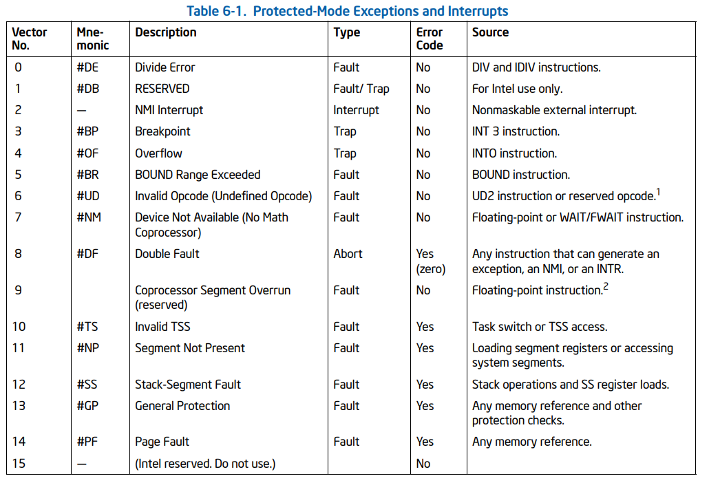
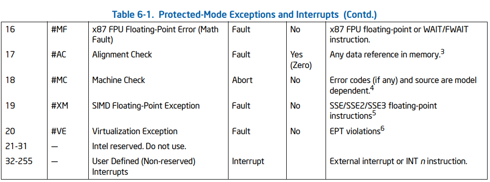
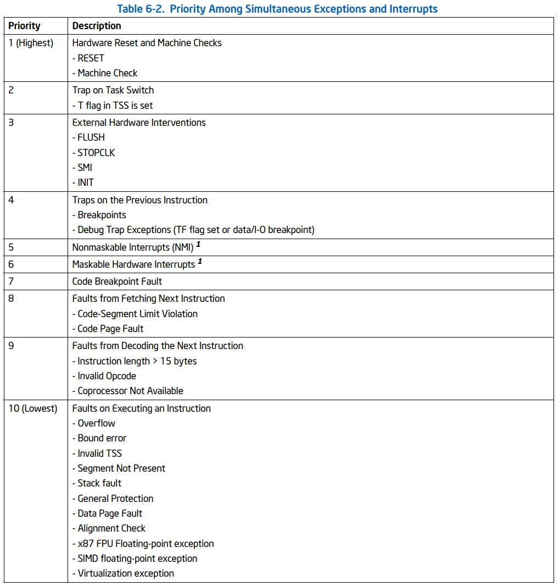
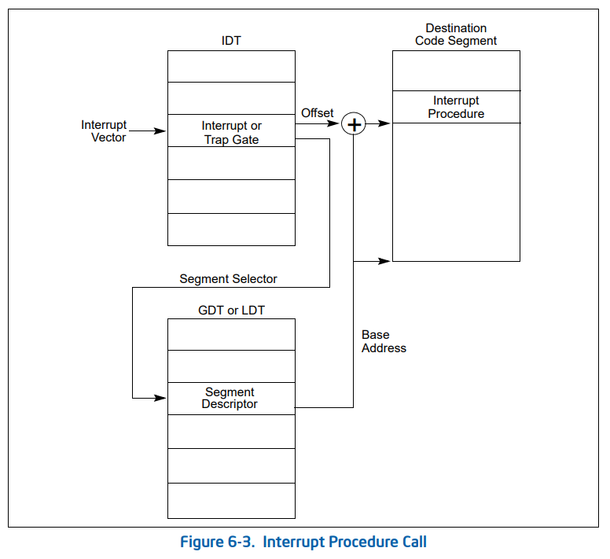
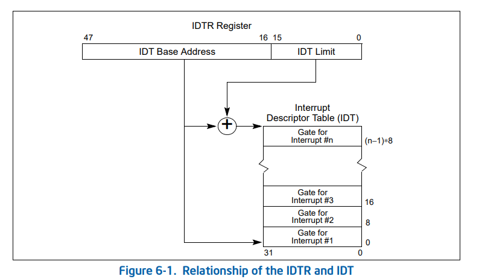
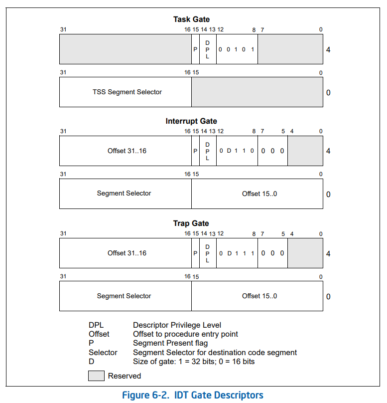

## 3. 中断和异常处理

### 3.1 中断和异常处理概述

中断和异常是指示系统、处理器或当前执行的程序或任务中某处存在需要处理器注意的条件的事件。它们通常会导致执行从当前运行的程序或任务强制转移到称为中断处理程序或异常处理程序的特殊软件例程或任务。 处理器响应中断或异常而采取的动作称为服务或处理中断或异常。

中断在程序执行期间随机发生，以响应来自硬件的信号。 系统硬件使用中断来处理处理器外部的事件，例如请求服务外围设备。

软件也可以通过执行 INT n 指令产生中断。

当处理器在执行指令时检测到错误条件（例如被零除）时，就会发生异常。 处理器检测各种错误情况，包括保护违规、页面错误和内部机器错误。当接收到中断或检测到异常时，当前运行的过程或任务将暂停，同时处理器执行中断或异常处理程序。 当处理程序的执行完成时，处理器恢复执行被中断的过程或任务。 中断过程或任务的恢复不会丢失程序连续性，除非无法从异常中恢复或中断导致当前运行的程序终止。

在实模式下，中断向量表占据内存最低的1KB，共256个表项。每个表项4子节，包含一个2子节的段地址和2子节的偏移，即中断处理程序的入口地址。但是在保护模式下，中断向量表可以在内存中自由浮动。就像GDT被GDTR指向一样，中断向量表被IDTR(Interrupt Descriptor Table Register，中断描述符表寄存器)指向。从表项上来看，除了指出中断处理程序的目标地址(16bit选择子和32bit偏移)外，IDT表项还为了进行特权级检测而加入的DPL域。此外，IDT表项还包含一个P比特。

实模式下，中断的处理过程很单一。当中断被触发时，CPU保护现场，跳转中断处理程序，执行完毕后恢复现场，继续执行原程序。但是，在保护模式下，中断的处理过程呈现出了多样化。中断处理过程因IDT中的描述符而异，可以分为三类。如果IDT描述符是一个TSS描述符，那么中断会引发任务切换。这种机制使得多任务轮询调度成为可能。如果IDT描述符是一个中断门描述符或者陷阱门描述符，则执行类似于实模式的中断跳转。

### 3.2 有关中断和异常了解性的内容

#### 中断和异常向量

为了帮助处理异常和中断，每个体系结构定义的异常和每个需要处理器特殊处理的中断条件都被分配了一个唯一的标识号，称为向量号。处理器使用分配给异常或中断的向量编号作为中断描述符表 (IDT) 的索引。该表提供异常或中断处理程序的入口点。

向量编号的允许范围是0到255。0到31范围内的矢量编号由 Intel 64和IA-32架构保留，用于架构定义的异常和中断。 并非此范围内的所有矢量编号都具有当前定义的功能。此范围内未分配的矢量编号被保留。32到255范围内的向量号被指定为用户定义的中断，并且不被Intel 64和IA-32架构保留。这些中断通常分配给外部I/O设备，使这些设备能够通过外部硬件中断机制向处理器发送中断。

#### 中断源

- 外部（硬件生成的）中断：通过处理器上的引脚或通过本地 APIC 接收外部中断。中断引脚连接到本地的APIC(高级可编程中断控制器)，当启用本地 APIC 时，可以通过 APIC 的本地向量表 (LVT) 对中断引脚进行编程，使其与任何处理器的异常或中断向量相关联。
    - 任何通过 INTR 引脚或通过本地 APIC 传送到处理器的外部中断都称为可屏蔽硬件中断。 可通过 INTR 引脚传送的可屏蔽硬件中断包括所有 IA-32 架构定义的中断向量，从 0 到 255； 可以通过本地 APIC 传送的中断向量包括中断向量 16 到 255。EFLAGS 寄存器中的 IF 标志允许将所有可屏蔽硬件中断屏蔽为一个组。

- 软件生成的中断：INT n 指令允许通过提供中断向量从软件内部产生中断数作为操作数。例如，INT 35指令强制对中断 35 的中断处理程序进行隐式调用。从 0 到 255 的任何中断向量都可以用作该指令中的参数。EFLAGS 寄存器中的 IF 标志无法屏蔽使用 INT n 指令在软件中生成的中断。

#### 异常源

- 处理器检测道德程序错误异常：当处理器在应用程序或操作系统或执行程序的执行过程中检测到程序错误时，它会生成一个或多个异常。 Intel 64 和 IA-32 架构为每个处理器可检测的异常定义了一个向量编号。

- 软件生成的异常：INTO、INT 3 和 BOUND 指令允许在软件中生成异常。这些指令允许在指令流中的点执行异常条件检查。

- 机器检查的异常：P6系列和奔腾处理器提供内部和外部机器检查机制，用于检查内部芯片硬件和总线事务的操作。当检测到机器检查错误时，处理器发出机器检查异常（向量 18）并返回错误代码。

#### 异常的分类：故障、陷阱和中止

- 故障：故障通常是可以纠正的异常，一旦纠正，程序就可以重新启动而不会失去连续性。当报告故障时，处理器将机器状态恢复到开始执行故障指令之前的状态。错误处理程序的返回地址（保存在 CS 和 EIP 寄存器中的内容）指向错误指令，而不是指向错误指令之后的指令。

- 陷阱：陷阱是在执行陷阱指令后立即报告的异常。陷阱允许程序或任务的执行在不丢失程序连续性的情况下继续进行。陷阱处理程序的返回地址指向陷阱指令之后要执行的指令。

- 中止：中止常用于报告严重错误，例如硬件错误和系统表中的不一致或非法值。

#### 程序或任务的重新执行

为了允许在处理异常或中断后重新启动程序或任务，所有异常（中止除外）都保证在指令边界上报告异常。 所有中断都保证在指令边界上发生。

- 对于故障类异常，返回指令指针（在处理器产生异常时保存）指向错误指令。 因此，当程序或任务在处理故障后重新启动时，故障指令将重新执行。

- 对于陷阱类异常，返回指令指针指向陷阱指令之后的指令。如果在转移执行的指令期间检测到陷阱，则返回指令指针指向转移指令。

- 中止类异常不支持程序或任务的可靠重启。 中止处理程序旨在收集有关发生中止异常时处理器状态的诊断信息，然后尽可能优雅地关闭应用程序和系统。

#### 开启和禁止中断

处理器会根据处理器的状态以及 EFLAGS 寄存器中的 IF 和 RF 标志的状态来抑制某些中断的产生。

- 屏蔽可屏蔽的硬件中断

    IF 标志可以禁用对在处理器的 INTR 引脚上或通过本地 APIC 接收到的可屏蔽硬件中断的服务。 当 IF 标志清零时，处理器禁止传递到 INTR 引脚或通过本地 APIC 生成内部中断请求的中断； 当设置 IF 标志时，传送到 INTR 或通过本地 APIC 引脚的中断将作为正常的外部中断处理。

    IF 标志不影响传递到 NMI 引脚的不可屏蔽中断 (NMI) 或通过本地 APIC 传递的传递模式 NMI 消息，也不影响处理器生成的异常。与 EFLAGS 寄存器中的其他标志一样，处理器清除 IF 标志以响应硬件复位。

- 屏蔽指令断点
    EFLAGS 寄存器中的 RF（恢复）标志控制处理器对指令断点条件的响应，设置后，它会阻止指令断点生成调试异常 (#DB)； 清除时，指令断点将产生调试异常。 RF 标志的主要功能是防止处理器在指令断点处进入调试异常循环。

- 切换堆栈时屏蔽异常和中断
    如果在段选择器加载到 SS 寄存器之后但在 ESP 寄存器加载之前发生中断或异常，则在中断或异常处理程序的处理时，这两部分进入堆栈空间的逻辑地址将会不一致。为防止这种情况，处理器会在 MOV 到 SS 指令或 POP 到 SS 指令之后禁止中断、调试异常和单步陷阱异常，直到到达下一条指令之后的指令边界。

#### 异常和中断的优先级

如果在一条指令边界处有多个异常或中断未决，处理器会以预定好的顺序为它们处理它们。

### 3.3 中断描述符表

中断描述符表 (IDT) 将每个异常或中断向量与用于服务相关异常或中断的过程或任务的门描述符相关联。

- 构成
    与 GDT 和 LDT 一样，IDT 是一个 8 字节描述符数组（在保护模式下）。 与 GDT 不同，IDT 的第一个条目可能包含一个描述符。为了形成 IDT 的索引，处理器将异常或中断向量按八（门描述符中的字节数）进行缩放。 因为只有 256 个中断或异常向量，所以 IDT 不需要包含超过 256 个描述符。 它可以包含少于 256 个描述符，因为只有可能发生的中断和异常向量才需要描述符。 IDT 中的所有空描述符槽都应该将描述符的当前标志设置为 0。IDT 可以驻留在线性地址空间中的任何位置。处理器使用 IDTR 寄存器定位 IDT。 该寄存器保存 IDT 的 32 位基地址和 16 位限制。

- 中断处理程序的地址

- 中断描述符表寄存器
    IDTR 寄存器定位 IDT，该寄存器保存 IDT 的 32 位基地址和 16 位限制。LIDT（加载 IDT 寄存器）和 SIDT（存储 IDT 寄存器）指令分别加载和存储 IDTR 寄存器的内容。 LIDT 指令将内存操作数中保存的基地址和限制加载到 IDTR 寄存器。SIDT 指令将存储在 IDTR 中的基值和限制值复制到内存中。

### 3.4 IDT描述符

### 3.5 中断与异常处理

- 中断过程调用的流程
    - 中断请求：外部设备或者操作系统会向处理器发送中断请求信号，以通知处理器发生了中断事件。

    - 中断响应：处理器在接收到中断请求信号后，会立即中止当前的执行流程，保存当前的上下文状态（包括当前指令的指针、寄存器状态等），并跳转到中断处理程序。

    - 中断处理：中断处理程序会根据中断类型进行相应的处理，例如处理外部设备的输入、更新系统状态等。在处理完成后，中断处理程序需要将处理结果存储到合适的位置。

    - 中断返回：处理器在中断处理程序执行完毕后，会从之前保存的上下文状态中恢复寄存器状态等，然后继续执行原先被中断的程序，使其能够从上次执行中断指令的下一条指令开始执行。

- 判断中断处理过程与被中断任务的优先级
    由操作系统的调度器来判断。调度器根据硬件提供的优先级信息和提前为每个任务分配的优先级数值来判断各中断任务的优先级。

- 不同优先级上的处理方式
    如果中断处理程序要在较低的优先级上运行，会触发堆栈切换。
    如果在相同优先级上运行，则不会切换堆栈。

- 发生堆栈切换，处理器的操作
    - 从当前执行任务的TSS中获取堆栈的段选择器和栈顶指针，在这个新堆栈上，处理器压入中断过程的堆栈段选择器和堆栈指针。
    - 处理器将 EFLAGS、CS 和 EIP 寄存器的当前状态保存到新堆栈中。
    - 如果异常导致错误代码被保存，则在 EIP 值之后被压入新堆栈。

- 没发生堆栈切换，处理器的操作
    - 处理器将 EFLAGS、CS 和 EIP 寄存器的当前状态保存在当前堆栈上。
    - 如果异常导致错误码被保存，则在EIP值之后被压入当前栈。

- 中断处理过程后，如何返回，处理器做了哪些操作？
    要从异常或中断处理程序返回，处理程序必须使用 IRET（IRETD）指令。IRET 指令类似于 RET 指令，只是它将保存的标志恢复到 EFLAGS 寄存器中。 只有当 CPL 为 0 时，EFLAGS 寄存器的 IOPL 字段才被恢复。只有当 CPL 小于或等于 IOPL 时，IF 标志才会改变。如果在调用处理程序过程时发生堆栈切换，则 IRET 指令在返回时会切换回被中断过程的原来的堆栈。

- 异常和中断处理过程的保护
    异常和中断处理程序的特权级保护类似于通过调用门调用时用于普通过程调用的保护，处理器不允许将执行转移到比 CPL 特权更少的代码段（数字上更高的特权级别）中的异常或中断处理程序。

- 异常和中断处理过程的标志使用方式
    当通过中断门或陷阱门访问异常或中断处理程序时，处理器在将 EFLAGS 寄存器的内容保存到堆栈后清除 EFLAGS 寄存器中的 TF 标志。 （在调用异常和中断处理程序时，处理器还会清除 EFLAGS 寄存器中的 VM、RF 和 NT 标志，在它们保存在堆栈中之后。）清除 TF 标志可防止指令跟踪影响中断响应。 随后的 IRET 指令将 TF（以及 VM、RF 和 NT）标志恢复为堆栈上 EFLAGS 寄存器保存内容中的值。

- 中断门与陷阱门的唯一区别
    中断门和陷阱门之间的唯一区别是处理器处理中断门的方式 EFLAGS 寄存器中的 IF 标志。 当通过中断门访问异常或中断处理程序时，处理器清除 IF 标志以防止其他中断干扰当前中断处理程序。 随后的 IRET 指令将 IF 标志恢复为其在堆栈上 EFLAGS 寄存器的保存内容中的值。通过陷阱门访问处理程序不会影响 IF 标志。