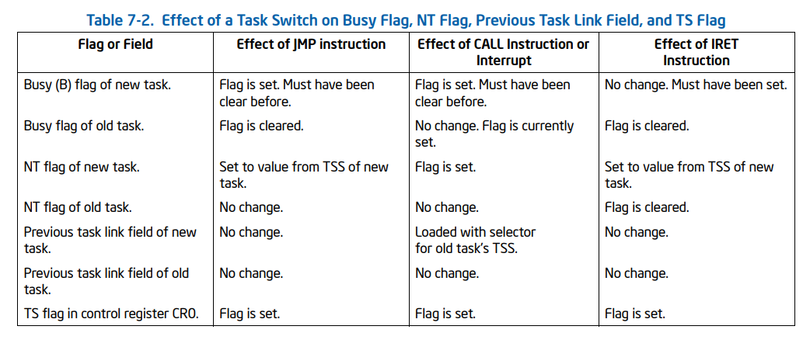

## 4. 任务管理

### 4.1 任务管理概述

任务是处理器可以分派、执行和暂停的工作单元。 它可用于执行程序、任务或进程、操作系统服务实用程序、中断或异常处理程序，或者内核或执行实用程序。

IA-32 架构提供了一种机制，用于保存任务状态、分派任务执行以及从一个任务切换到另一个任务。 在保护模式下运行时，所有处理器的执行都在任务中进行。 即使是简单的系统也必须至少定义一项任务。 更复杂的系统可以使用处理器的任务管理工具来支持多任务应用程序。

##### 与任务相关的描述符

- TSS 描述符（Task State Segment Descriptor）：TSS 描述符用于指向任务状态段（Task State Segment，TSS），TSS 存储任务的上下文信息，包括任务的寄存器值、堆栈指针和代码段指针等。当处理器执行任务切换时，会使用 TSS 描述符来获取任务的上下文信息，以便恢复任务的执行状态。

- LDT 描述符（Local Descriptor Table Descriptor）：LDT 描述符用于指向任务的本地描述符表（Local Descriptor Table，LDT），LDT 存储任务的局部描述符信息，包括任务使用的代码段、数据段和堆栈段等。当任务需要访问局部描述符表中的描述符时，处理器会使用 LDT 描述符来获取 LDT 的位置和大小信息。

- 段选择符（Segment Selector）：段选择符用于标识任务中使用的段描述符，包括代码段描述符、数据段描述符和堆栈段描述符等。每个任务都有自己的段选择符，用于访问任务的各种段描述符。处理器可以使用段选择符来获取相应的段描述符，并根据段描述符的信息访问相应的内存区域。

##### 任务切换与过程调用

任务切换和过程调用是两种不同的机制，它们之间的主要区别在于作用对象、调用方式、上下文保存和调用返回等方面，具体如下：

- 作用对象：任务切换主要用于多任务操作系统中，通过切换任务来实现多任务并发执行；过程调用主要用于单任务程序中，通过调用函数来实现程序的模块化设计和代码复用。

- 调用方式：任务切换是由操作系统内核自动完成的，无需显式调用；过程调用是通过调用函数来完成的，需要显式地调用函数。

- 上下文保存：任务切换需要保存当前任务的上下文信息（包括寄存器值、程序计数器和堆栈指针等），以便切换回该任务时能够正确地恢复任务的执行状态；过程调用只需要保存当前函数的局部变量、参数和返回地址等信息，以便在函数返回时能够正确地恢复函数的执行状态。

- 调用返回：任务切换会切换到另一个任务并执行其代码，而不会立即返回原任务；过程调用会执行完函数代码并返回调用者。

#### 4.1.1 任务的结构

任务由两部分组成：任务执行空间和任务状态段（TSS）。 任务执行空间由代码段、堆栈段和一个或多个数据段组成。如果操作系统或执行程序使用处理器的特权级保护机制，则任务执行空间也为每个权限级别提供一个单独的堆栈。

#### 4.1.2 任务的状态

一个正在被执行的任务状态包括：

- 任务当前执行的空间，由各种段选择子决定（CS, DS, SS, ES, FS和GS）。在线性地址空间中，是一个段空间
- 通用寄存器状态，包括EAX, ECX, EDX, EBX, ESP, ESI和EDI的值
- EIP寄存器的状态，即EIP的值
- CR3控制寄存器的值
- 任务寄存器（TR）的状态
- LDTR寄存器的状态
- I/O内存映射的基地址（包含在TSS中），（共享内存？）
- 三个栈指针，分别指向特权级0， 1， 2的栈地址
- 上一个被执行的任务的link（地址）

#### 4.1.3 任务的执行

软件或者处理器可以使用以下几种方法调度一个任务

- 显式使用CALL指令调用某个任务
- 显式使用JUMP指令跳转到某个任务
- 由处理器隐式调用中断处理任务
- 隐式调用异常处理任务
- 如果EFLAGS寄存器的NT标志被设置，那么可以使用IRET指令在返回时隐式调转到某个任务

上述的所有方法都是通过一个指向任务段描述符的选择子或者指向任务门描述符的选择子实现的。

### 4.2 任务的数据结构

处理器定义了五个数据结构来处理与任务相关的活动：

- 任务状态段(TSS)。
- 任务门描述符。
- TSS 描述符。
- 任务寄存器。
- EFLAGS寄存器中的NT标志位。

#### TSS

恢复任务所需的处理器状态信息保存在称为任务状态段 (TSS) 的系统段中:

动态字段：

- 通用寄存器字段：EAX、ECX、EDX、EBX、ESP、EBP、ESI和EDI寄存器在任务切换之前的状态。
- 段选择器字段：段选择器在任务切换之前存储在ES、CS、SS、DS、FS和GS寄存器中。
- EFLAGS 寄存器域：EFLAGS 寄存器在任务切换之前的状态。
- EIP（指令指针）字段：任务切换之前EIP 寄存器的状态。
- 前一个任务链接字段：包含前一个任务的TSS 的段选择器（在由调用、中断或异常启动的任务切换时更新）。该字段（有时称为反向链接字段）允许使用 IRET 指令将任务切换回先前的任务。

静态字段：

- LDT段选择器字段：包含任务的 LDT 的段选择器。
- CR3 控制寄存器字段：包含任务要使用的页面目录的基本物理地址。
- 权限级别 0、-1 和 -2 堆栈指针字段 — 这些堆栈指针由一个逻辑地址组成，该逻辑地址由堆栈段（SS0、SS1 和 SS2）的段选择器和堆栈中的偏移量（ESP0 、ESP1 和 ESP2）。
- T（调试陷阱）标志（字节 100，位 0）— 设置时，T 标志会导致处理器在任务切换到此任务时引发调试异常。
- I/O 映射基址字段：包含从 TSS 基址到 I/O 许可位图和中断重定向位图的 16 位偏移量。

#### 任务寄存器

任务寄存器保存 16 位段选择符和整个段描述符（32 位基地址（IA-32e 模式下为64位）、16 位段限制和描述符属性）用于当前任务的 TSS。

#### 任务门描述符

任务门描述符提供对任务的间接、受保护的引用。它可以放在 GDT、LDT 或 IDT 中。 任务门描述符中的 TSS 段选择器字段指向 GDT 中的 TSS 描述符。

### 4.3 任务切换

在任务切换过程中，假设由于某种原因（通常是属于某个任务的时间片用光），处理器将从当前正在执行的任务A切换到另一个任务B。此时，处理器需要记录任务A的所有状态以便当切换回任务A时就好像没离开过一样，所以，处理器会先将任务A的状态（上面列出的任务状态）存储在任务A的TSS中（任务状态段）。然后将任务A挂起，并将任务B的状态加载到处理器上（从B的TSS中），以此完成任务切换。

处理器执行任务切换的情况：

- 当前任务A执行了JMP或CALL指令显示调用任务B。JMP和CALL的操作数为段选择子，指向GDT中任务B的TSS段描述符
- 当前任务A执行了JMP或CALL指令显示调用任务B。JMP和CALL的操作数为段选择子，指向GDT或任务B的LDT中的任务门描述符
- 当前任务A出现一个指向IDT中任务门描述符的中断/异常向量
- 当前任务A执行了IRET指令且EFLAGS寄存器中的NT标志位被设置

任务切换处理器的操作：

- 从任务门或先前的任务链接字段（对于使用 IRET 指令启动的任务切换），获取新任务的 TSS 段选择器作为 JMP 或 CALL 指令的操作数。
- 检查是否允许当前（旧）任务切换到新任务。 数据访问权限规则适用于 JMP 和 CALL 指令。 当前（旧）任务的 CPL 和新任务的段选择器的 RPL 必须小于或等于被引用的 TSS 描述符或任务门的 DPL。
- 检查新任务的 TSS 描述符是否标记为存在并且具有有效限制。
- 检查新任务是否可用（调用、跳转、异常或中断）或忙（IRET 返回）。
- 检查任务切换中使用的当前（旧）TSS、新 TSS 和所有段描述符是否已分页到系统内存中。
- 如果任务切换是用 JMP 或 IRET 指令启动的，处理器会清除当前（旧）任务的 TSS 描述符中的忙（B）标志； 如果使用 CALL 指令、异常或中断启动：busy (B) 标志保持设置。
- 如果任务切换是用 IRET 指令启动的，处理器会清除 EFLAGS 寄存器临时保存映像中的 NT 标志； 如果使用 CALL 或 JMP 指令、异常或中断启动，则保存的 EFLAGS 映像中的 NT 标志将保持不变。
- 在当前任务的 TSS 中保存当前（旧）任务的状态。 处理器在任务寄存器中找到当前TSS的基地址，然后将以下寄存器的状态复制到当前TSS中：所有通用寄存器，来自段寄存器的段选择器，EFLAGS寄存器的临时保存映像和指令指针寄存器 (EIP)。
- 如果任务切换是用 CALL 指令、异常或中断启动的，处理器将在从新任务加载的 EFLAGS 中设置 NT 标志。 如果用 IRET 指令或 JMP 指令启动，NT 标志将反映从新任务加载的 EFLAGS 中 NT 的状态
- 如果任务切换是用 CALL 指令、JMP 指令、异常或中断启动的，则处理器在新任务的 TSS 描述符中设置忙 (B) 标志； 如果使用 IRET 指令启动，则忙 (B) 标志保持设置状态。
- 将新任务的 TSS 的段选择器和描述符加载到任务寄存器中。
- TSS 状态被加载到处理器中。 这包括 LDTR 寄存器、PDBR（控制寄存器 CR3）、EFLAGS 寄存器、EIP 寄存器、通用寄存器和段选择器。 加载此状态期间的故障可能会破坏体系结构状态。
- 加载并限定与段选择器相关的描述符。 与此加载和资格相关的任何错误都发生在新任务的上下文中，并且可能会破坏体系结构状态。
- 开始执行新任务。

### 4.4 任务链

TSS 的前一个任务链接字段（有时称为“反向链接”）和 EFLAGS 寄存器中的 NT 标志用于将执行返回到前一个任务。 EFLAGS.NT = 1 表示当前执行的任务嵌套在另一个任务的执行中。

当 CALL 指令、中断或异常导致任务切换时：处理器将当前 TSS 的段选择符复制到新任务的 TSS 的前一个任务链接字段； 然后设置 EFLAGS.NT = 1。如果软件使用 IRET 指令暂停新任务，处理器检查EFLAGS.NT = 1； 然后它使用上一个任务链接字段中的值返回到上一个任务。

当 JMP 指令导致任务切换时，新任务不会嵌套。 未使用先前的任务链接字段且 EFLAGS.NT = 0。当不需要嵌套时，使用 JMP 指令分派新任务。

下图显示了任务切换期间的忙标志（在 TSS 段描述符中）、NT 标志、前一个任务链接字段和 TS 标志（在控制寄存器 CR0 中）。

### 4.5 任务地址空间

任务的地址空间由任务可以访问的段组成。 这些段包括 TSS 中引用的代码、数据、堆栈和系统段以及任务代码访问的任何其他段。这些段被映射到处理器的线性地址空间，而线性地址空间又被映射到处理器的物理地址空间（直接或通过分页）。

TSS 中的 LDT 段字段可用于为每个任务提供其自己的 LDT。 通过将与任务关联的所有段的段描述符放在任务的 LDT 中，为任务提供自己的 LDT 允许任务地址空间与其他任务隔离。

#### 将任务映射到线性和物理地址空间

可以通过以下两种方式之一将任务映射到线性地址空间和物理地址空间：

- 所有任务共享一个线性到物理地址空间映射： 未启用分页时，这是唯一的选择。 在没有分页的情况下，所有线性地址都映射到相同的物理地址。 当启用分页时，这种形式的线性到物理地址空间映射是通过对所有任务使用一个页面目录来获得的。 如果支持请求分页虚拟内存，线性地址空间可能会超过可用的物理空间。
- 每个任务都有自己的映射到物理地址空间的线性地址空间： 这种形式的映射是通过为每个任务使用不同的页面目录来完成的。 因为PDBR（控制寄存器CR3）加载在任务开关上，每个任务可能有不同的页目录。

#### 任务逻辑地址空间

要允许在任务之间共享数据，请使用以下技术创建共享的逻辑到物理数据段的地址空间映射：

- 通过GDT中的段描述符:所有任务都必须能够访问GDT 中的段描述符。 如果 GDT 中的某些段描述符指向线性地址空间中的段，这些段映射到所有任务共有的物理地址空间区域，那么所有任务都可以共享这些段中的数据和代码。
- 通过共享LDT：如果两个或多个任务的TSS 中的LDT 字段指向同一个LDT，则两个或多个任务可以使用同一个LDT。 如果共享 LDT 中的某些段描述符指向映射到物理地址空间公共区域的段，则这些段中的数据和代码可以在共享 LDT 的任务之间共享。 这种共享方法比通过 GDT 共享更具选择性，因为共享可以限于特定任务。系统中的其他任务可能有不同的 LDT，这些 LDT 不允许它们访问共享段。
- 通过映射到线性地址空间中公共地址的不同LDT 中的段描述符:如果线性地址空间的这个公共区域被映射到每个任务的物理地址空间的相同区域，这些段描述符允许任务共享段。 这样的段描述符通常称为别名。 这种共享方法比上面列出的方法更具选择性，因为 LDT 中的其他段描述符可能指向不共享的独立线性地址。
